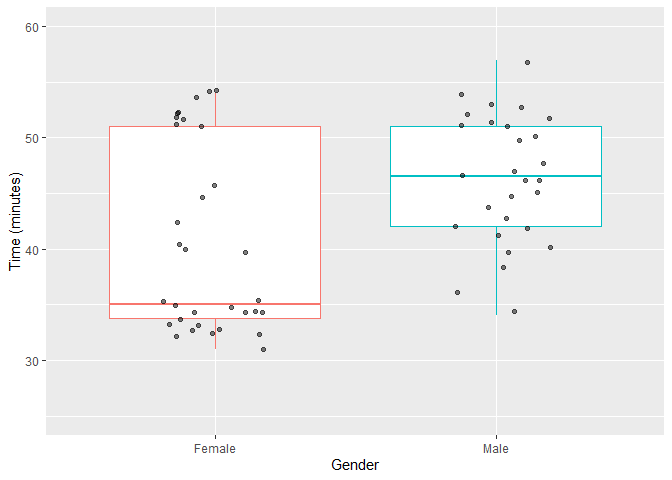

Point-biserial
================

Biserial and point-biserial correlation coefficients are used when one
of the two variables is dichotomous (i.e., categorical with only two
categories). The choice between biserial and point-biserial correlations
depends on whether the dichotomous variable is **discrete**\* or
**continuous**:

- Discrete: For example, whether someone is dead or alive. A person can
  only be dead or alive - they cannot be “partially dead.”
- Continuous: For example, passing or failing a test. Some individuals
  may barely fail, while others fail by a large margin.

The point-biserial correlation coefficient ($r_{pb}$) is used when one
variable is a discrete dichotomy, whereas the biserial correlation
coefficient ($r_b$) is used when one variable is a continuous dichotomy.

# Point-biserial correlation

We are interested in investigating how the gender of cats associates
with the time they spent away from home. The time spent away from home
is measured at an interval level while the gender of the cat is a
discrete dichotomy. A point-biserial correlation is appropriate for this
data.

``` r
url <- "https://studysites.sagepub.com/dsur/study/DSUR%20Data%20Files/Chapter%206/pbcorr.csv"
catData <- read.csv(url, header = TRUE) %>%
  select(time, gender) 
head(catData)
```

    ##   time gender
    ## 1   41      1
    ## 2   40      0
    ## 3   40      1
    ## 4   38      1
    ## 5   34      1
    ## 6   46      0

Let’s start by visualizing the relationship between `gender` and `time`
using a boxplot, which is well-suited for comparing a continuous
variable across two categories. Before doing so, we must first assign
labels to each level of our `gender` variable so that values become
meaningful.

``` r
catData <- catData %>% 
  rename(gender_encoded = gender) %>% 
  mutate(gender = factor(
    gender_encoded,
    levels = c(0, 1),
    labels = c("Female", "Male")
  )) 
head(catData)
```

    ##   time gender_encoded gender
    ## 1   41              1   Male
    ## 2   40              0 Female
    ## 3   40              1   Male
    ## 4   38              1   Male
    ## 5   34              1   Male
    ## 6   46              0 Female

``` r
# Visualizing the relationship between gender and time
ggplot(catData, aes(x = gender, y = time)) +
  geom_boxplot(aes(color = gender)) +
  geom_jitter(width = 0.2, alpha = 0.5) +
  labs(
    x = "Gender", 
    y = "Time (minutes)"
  ) +
  ylim(25, 60) + 
  theme(legend.position = "none")
```

<!-- -->

The medians for females and males differ noticeably, suggesting a
relationship between gender and time. The median for females is lower
than that for males, and since the dichotomous variable is coded as
$Female = 0$ and $Male = 1$, this indicates a positive correlation.
Additionally, the wider box for females shows greater variability in
their times compared to males.

To calculate the correlation, we will need to use the `gender_encoded`
variable. A point-biserial correlation is essentially a Pearson
correlation, with the dichotomous variable coded as 0 and 1.

``` r
# Point-biserial correlation
cor.test(catData$gender_encoded, catData$time)
```

    ## 
    ##  Pearson's product-moment correlation
    ## 
    ## data:  catData$gender_encoded and catData$time
    ## t = 3.1138, df = 58, p-value = 0.002868
    ## alternative hypothesis: true correlation is not equal to 0
    ## 95 percent confidence interval:
    ##  0.137769 0.576936
    ## sample estimates:
    ##       cor 
    ## 0.3784542

The results show that there is significant, moderate positive
relationship between Gender and Time, $r_{pb}$ = .378, $p = .003$.
